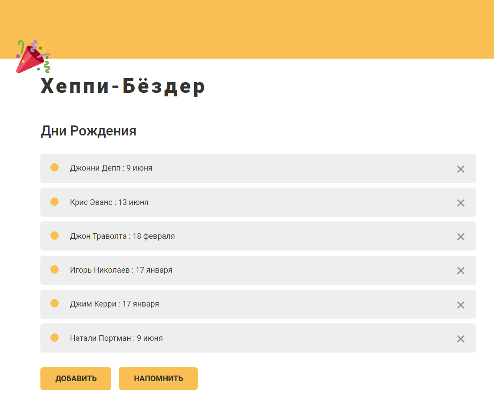
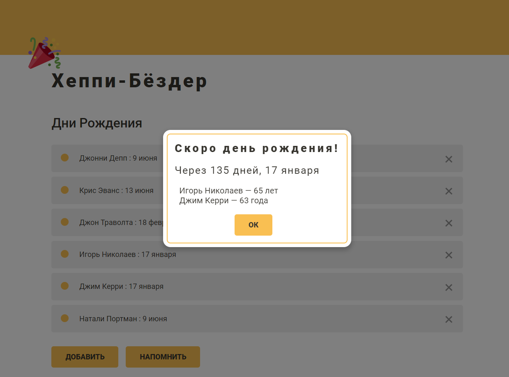
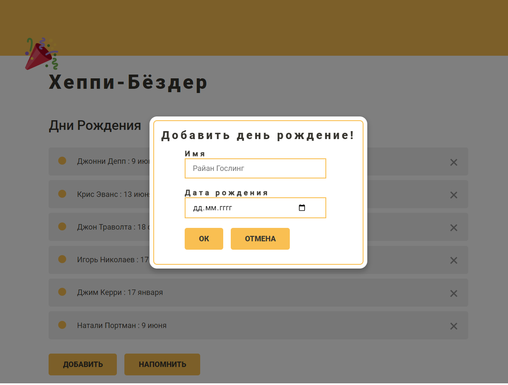
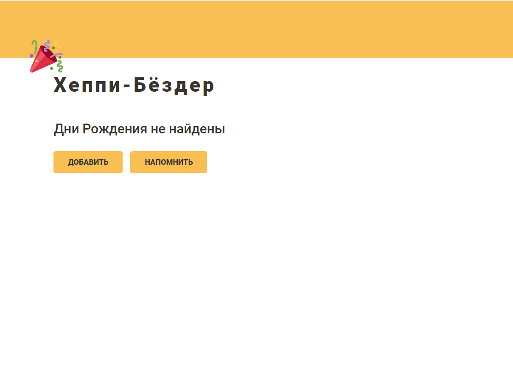

# 🎉 Хеппи-Бёздер
### Задача : 
Реализовать напоминание о ближайшем дне рождения.
Система хранит имена и даты рождения людей. Необходимо найти в системе ближайший день рождения
к сегодняшнему дню и вывести его на экран. Также необходимо указать возраст человека и количество дней до этого дня. 
Если это сегодня, указать, что это сегодня. Если их несколько, то они выводятся последовательно.
## Главный экран 

## Уведомление о ближайших днях рождениях 

## Popup для добавления нового дня рождения 

### Пустой список

